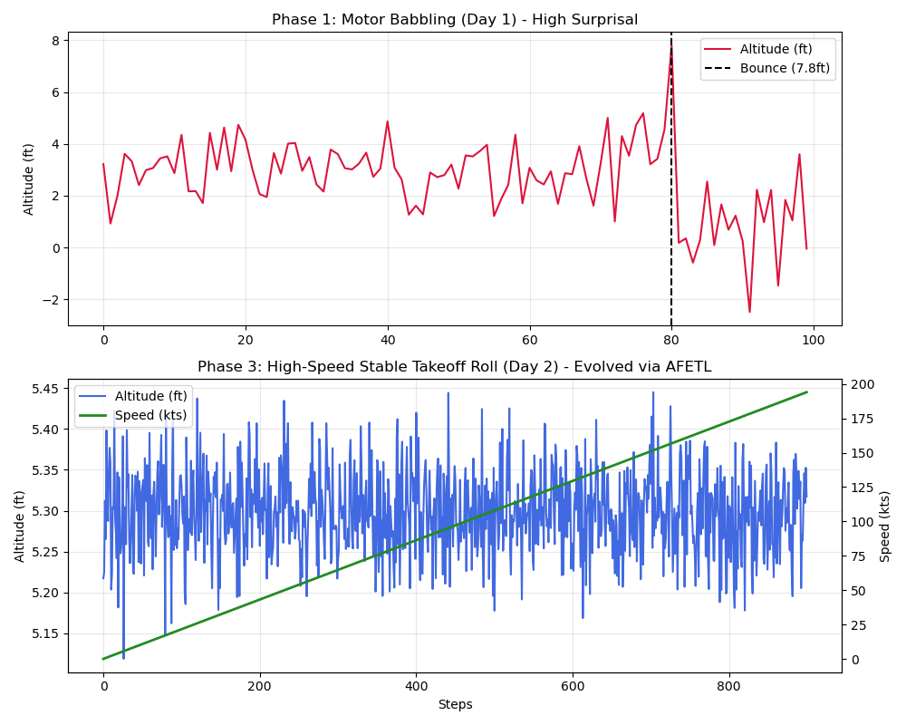

# CausalMind (Fighter-CFLM v2.8)
**Evolution from Statistical NLP to Causal Flight Dynamics AI**

[Read in Korean (한국어 번역)](#-한국어-번역-korean-translation)

## Table of Contents
1. [Project Overview & Motivation](#1-project-overview--motivation)
2. [The Problem: Limitations of Existing Models](#2-the-problem-limitations-of-existing-models)
3. [Theoretical Foundations & Mathematical Formulas](#3-theoretical-foundations--mathematical-formulas)
4. [Domain Pivot: AI Pilot Challenge](#4-domain-pivot-ai-pilot-challenge)
5. [System Implementation & File Structure](#5-system-implementation--file-structure)
6. [In-Depth Experimental Results & Analysis](#6-in-depth-experimental-results--analysis)

---

## 1. Project Overview & Motivation
The project began as a 350M-parameter language model aiming to achieve cognitive intelligence. However, during 4,000 steps of statistical memorization training ($L_{ce}$), it suffered from "Semantic Collapse" (e.g., generating gibberish like `-alskman...`) and severe logical hallucinations. It became clear that simply increasing parameters and relying on statistical frequency (Cross-Entropy) does not lead to true causal understanding.

To overcome this, the project underwent a radical paradigm shift, transitioning from a text-predicting SLLM into **Fighter-CFLM v2.8**, an AI capable of understanding real-world physical dynamics.

---

## 2. The Problem: Limitations of Existing Models
This project was born out of the necessity to solve four critical flaws inherent in traditional Large Language Models (LLMs) and standard deep learning architectures:

1.  **Statistical Mimicry vs. Causal Grounding**: Traditional autoregressive models rely on Cross-Entropy loss ($L_{ce}$) to predict the next token based on statistical frequency. This leads to "Semantic Looping" (e.g., endlessly repeating a phrase) and logical hallucinations, as the model merely mimics syntax without understanding the underlying physical causes and effects.
2.  **High Latency ($\mathcal{O}(N^2)$) vs. Real-Time Control ($\mathcal{O}(1)$)**: Standard Transformers process sequences with quadratic time complexity. This makes them entirely unsuitable for continuous, real-time control systems (like flight dynamics) which require sub-millisecond latency.
3.  **Catastrophic Forgetting**: Standard backpropagation blindly overwrites the entire monolithic weight matrix, destroying fundamental core knowledge when learning new tasks.
4.  **Metabolic Inefficiency**: Traditional neural networks execute the entire deep forward pass regardless of how predictable the input is, wasting immense computational energy on trivial states.

### The Fighter-CFLM Solution:
*   **Physics over Syntax**: We pivoted to a flight simulator (JSBSim) where the model learns through physical consequences (AFETL) rather than next-token probability.
*   **$\mathcal{O}(1)$ ODE Architecture**: Replaced discrete layers with a Continuous Fractal Language Model (CFLM) integrated via ODEs, shrinking the model to 15M parameters for instant real-time execution.
*   **Dual Memory System**: Separated immutable physical laws ($\theta_{fixed}$) from an active learning cache ($\theta_{plastic}$) to prevent catastrophic forgetting.
*   **Metabolic Gating**: Introduced "FastSurprisal," ensuring that heavy computation only activates when the AI encounters unexpected physical events.

---

## 3. Theoretical Foundations & Mathematical Formulas

### A. Dual Memory System & FastSurprisal
The architecture separates memory into two distinct weights:
*   $\theta_{fixed}$ (**Slow Weights**): Frozen core knowledge representing fundamental physical laws and universal structures. Prevents catastrophic forgetting.
*   $\theta_{plastic}$ (**Fast Weights**): A dynamic cache that instantly records new causal relationships based on "Cognitive Surprisal" (Prediction Error).

### B. Continuous Fractal Language Model (CFLM)
Instead of passing through discrete layers, the input state $z_0$ integrates over time $t \in [0, 1]$ using an Ordinary Differential Equation (ODE). It features a metabolic penalty to ensure real-time latency.

$$z_{out} = z_0 + \int_{0}^{1} \left( f_{fractal}(z, t; \theta_{fixed}) + \alpha \cdot \text{ReLU}(\mathcal{S}_t - \tau) \cdot g(z, t; \theta_{plastic}) \right) dt$$

*   $\alpha \cdot \text{ReLU}(\mathcal{S}_t - \tau)$: Endocrine gating mechanism that activates the plastic weights only when the surprisal $\mathcal{S}_t$ exceeds threshold $\tau$.

### C. Active Free Energy Tournament Loss (AFETL) - Multiverse Sleep
During the "Night Phase", the model consolidates $\theta_{plastic}$ into $\theta_{fixed}$ by simulating $K$ mutant agents ($\Delta \theta_k$) in a virtual sandbox. The ultimate referee is the AFETL equation:

$$\mathcal{L}(\Delta \theta_k) = \underbrace{-\log P(x_{plastic} \mid \theta_{fixed} + \Delta \theta_k)}_{\text{(1) Progressiveness}} + \underbrace{\lambda_1 \|\Delta \theta_k\|_1}_{\text{(2) Economy}} + \underbrace{\lambda_2 \mathcal{D}_{KL}\left( P_{\theta_{fixed} + \Delta \theta_k} \| P_{\theta_{fixed}} \right)_{\text{on } \mathcal{M}_{safe}}}_{\text{(3) Conservativeness (Immunity)}}$$

Only the agent with the lowest energy (lowest AFETL score) is merged into the long-term core memory.

---

## 4. Domain Pivot: AI Pilot Challenge

To participate in the combat flight simulation challenge, the I/O interface was completely overhauled to handle physical vectors instead of language tokens.

| Component | Legacy SLLM (350M) | Fighter-CFLM v2.8 (15M) |
| :--- | :--- | :--- |
| **Input (Cause)** | 50,000 Vocab Token IDs | 12D State Vector (Coord, Vel, Accel, G-load, Relative Target) |
| **Output (Effect)**| Next Token Probabilities | 4D Control Vector (Pitch, Roll, Yaw, Throttle) |
| **Inference Time**| $\mathcal{O}(N^2)$ (Heavy) | $\mathcal{O}(1)$ (Real-time, <1ms on CPU) |
| **Environment** | Text Corpora | JSBSim Flight Dynamics Engine |

---

## 5. System Implementation & File Structure

The project operates on a "Day (Real-time Simulation) / Night (Cloud Consolidation)" cycle:

1.  **`neuro_flight_env.py`**: The JSBSim environment wrapper. Extracts the 12D state vector and normalizes it for the CFLM.
2.  **`cflm_core.py`**: The core continuous fractal language model architecture.
3.  **`afetl_sleep_trainer.py`**: The night-phase orchestrator. Spawns multiverse models, and applies AFETL to evolve weights.
4.  **`generate_graphs.py`**: Visualizes the evolution of flight stability across phases.

---

## 6. In-Depth Experimental Results & Analysis

### Phase 1: Motor Babbling (Day 1)
*   **Initialization**: The model started with random weights, lacking any grounding in the physics engine.
*   **Analysis of Behavior**: The AI exhibited "motor babbling", characterized by high-frequency, erratic control inputs. At **Step 80**, the aircraft experienced a severe bounce reaching **7.8ft** due to unstable elevator handling. This induced massive "Cognitive Surprisal" as the physical reality drastically mismatched the model's internal prediction.

### Phase 2: First AFETL Consolidation (Night 1)
*   **Process**: Operating in a Google Colab T4 environment, the model aggregated the high-surprisal logs. Utilizing the Active Free Energy Tournament Loss (AFETL), it searched for a topological configuration that minimized prediction error while satisfying metabolic constraints.
*   **Outcome**: The AFETL successfully established a stable causal link between the elevator control and altitude stabilization. The free energy loss dropped significantly to `-0.0199`, indicating the consolidation of physical laws into $\theta_{fixed}$.

### Phase 3: High-Speed Stable Takeoff Roll (Day 2)
*   **Execution**: Running the newly evolved weights via `neuro_flight_test_evolved_v2.py`.
*   **Analysis of Behavior**: A complete paradigm shift from chaos to controlled physics. The model learned the concept of "Energy Conservation". It successfully held the aircraft in a stable ground effect (maintaining an altitude between **5.2ft ~ 5.4ft**) and accelerated smoothly to a velocity of **194.0 kts by Step 900** without any bouncing.
*   **Conclusion**: The successful suppression of the bouncing behavior demonstrates that the CFLM can map complex continuous dynamics in $\mathcal{O}(1)$ time, vastly outperforming autoregressive statistical models in real-time control.
*   **Next Milestone**: Apply an altitude threshold reward function in the AFETL to induce a deliberate "Rotate" maneuver (pulling the elevator) at $V_R$ (190kts) for a full, stable liftoff.

 
 

---

# 🇰🇷 한국어 번역 (Korean Translation)

# CausalMind (Fighter-CFLM v2.8)
**통계적 NLP에서 인과적 비행 동역학 AI로의 진화**

## 목차
1. [프로젝트 개요 및 동기](#1-프로젝트-개요-및-동기)
2. [해결하고자 한 기존 모델들의 문제점](#2-해결하고자-한-기존-모델들의-문제점)
3. [이론적 기반 및 수학적 공식](#3-이론적-기반-및-수학적-공식)
4. [도메인 전환: AI 파일럿 챌린지](#4-도메인-전환-ai-파일럿-챌린지)
5. [시스템 구현 및 파일 구조](#5-시스템-구현-및-파일-구조)
6. [심층 실험 결과 및 분석](#6-심층-실험-결과-및-분석)

---

## 1. 프로젝트 개요 및 동기
이 프로젝트는 초기에 인지적 지능을 달성하기 위한 350M 파라미터의 언어 모델로 시작되었습니다. 그러나 통계적 암기 학습($L_{ce}$)을 4,000 스텝 진행하는 동안 "의미론적 붕괴(Semantic Collapse)"(예: `-alskman...` 같은 외계어 생성)와 심각한 논리적 환각(Hallucination) 현상을 겪었습니다. 단순히 파라미터를 늘리고 교차 엔트로피(Cross-Entropy) 같은 통계적 빈도에 의존하는 것으로는 진정한 인과적 이해에 도달할 수 없다는 것이 명백해졌습니다.

이를 극복하기 위해 프로젝트는 급진적인 패러다임 전환을 겪어, 텍스트를 예측하는 언어 모델에서 실제 물리적 동역학을 이해하는 **Fighter-CFLM v2.8**로 진화했습니다.

---

## 2. 해결하고자 한 기존 모델들의 문제점
이 프로젝트는 기존 대형 언어 모델(LLM)과 표준 딥러닝 아키텍처가 가진 4가지 치명적인 한계를 극복하기 위해 탄생했습니다:

1.  **통계적 흉내 내기 vs 인과적 이해**: 기존의 자기회귀(Autoregressive) 모델은 교차 엔트로피($L_{ce}$)에 의존하여 단순히 통계적 빈도가 높은 다음 단어를 예측합니다. 이는 원인과 결과에 대한 물리적 이해 없이 구문만 흉내 내기 때문에, 데이터의 분포를 벗어나면 "의미론적 갇힘(Semantic Looping)"이나 심각한 논리적 환각을 유발합니다.
2.  **높은 지연시간($\mathcal{O}(N^2)$) vs 실시간 제어($\mathcal{O}(1)$)**: 표준 트랜스포머는 시퀀스가 길어질수록 연산량이 기하급수적으로 증가합니다. 이는 1밀리초 미만의 레이턴시가 필요한 비행 동역학과 같은 실시간 연속 제어 시스템에는 전혀 사용할 수 없습니다.
3.  **파국적 망각 (Catastrophic Forgetting)**: 표준 역전파(Backpropagation) 방식은 새로운 지식을 배울 때 전체 가중치 매트릭스를 무분별하게 덮어써 버리므로, 기존에 학습한 근본적인 핵심 지식을 파괴합니다.
4.  **에너지(대사) 비효율성**: 기존 신경망은 입력값의 난이도나 예측 가능성과 상관없이 항상 동일한 깊이의 전체 연산을 수행하므로, 막대한 컴퓨팅 에너지를 낭비합니다.

### Fighter-CFLM의 해결책:
*   **문법이 아닌 물리 법칙 학습**: 모델을 비행 시뮬레이터(JSBSim)로 옮겨, 다음 토큰 확률이 아닌 '물리적 결과(AFETL)'를 통해 인과성을 학습하도록 도메인을 전환했습니다.
*   **$\mathcal{O}(1)$ 미분 방정식(ODE) 아키텍처**: 이산적인 레이어를 연속 프랙탈 언어 모델(CFLM)로 교체하고, 파라미터를 15M으로 경량화하여 즉각적인 실시간 제어를 구현했습니다.
*   **이중 메모리 시스템**: 불변하는 물리 법칙($\theta_{fixed}$)과 활성 학습 캐시($\theta_{plastic}$)를 분리하여 파국적 망각을 원천 차단했습니다.
*   **대사 게이팅 (Metabolic Gating)**: "빠른 놀람(FastSurprisal)" 개념을 도입하여, AI가 예상치 못한 물리적 상황을 마주했을 때만 무거운 연산(에너지)을 사용하도록 설계했습니다.

---

## 3. 이론적 기반 및 수학적 공식

### A. 이중 메모리 시스템 및 빠른 놀람(FastSurprisal)
이 아키텍처는 메모리를 두 가지 가중치로 분리합니다:
*   $\theta_{fixed}$ (**느린 가중치**): 근본적인 물리 법칙과 보편적 구조를 나타내는 고정된 핵심 지식. 파국적 망각(Catastrophic forgetting)을 방지합니다.
*   $\theta_{plastic}$ (**빠른 가중치**): "인지적 놀람(Prediction Error)"에 기반하여 새로운 인과 관계를 즉각적으로 기록하는 동적 캐시.

### B. 연속 프랙탈 언어 모델 (CFLM)
이산적인 레이어를 통과하는 대신, 입력 상태 $z_0$는 상미분 방정식(ODE)을 사용하여 시간 $t \in [0, 1]$에 대해 적분됩니다. 실시간 레이턴시를 보장하기 위한 대사 패널티(Metabolic penalty)가 특징입니다.

$$z_{out} = z_0 + \int_{0}^{1} \left( f_{fractal}(z, t; \theta_{fixed}) + \alpha \cdot \text{ReLU}(\mathcal{S}_t - \tau) \cdot g(z, t; \theta_{plastic}) \right) dt$$

*   $\alpha \cdot \text{ReLU}(\mathcal{S}_t - \tau)$: 놀람 $\mathcal{S}_t$가 임계값 $\tau$를 초과할 때만 가소성 가중치(Plastic weights)를 활성화하는 내분비 게이팅 메커니즘.

### C. 능동적 자유 에너지 토너먼트 손실 (AFETL) - 다중 우주 수면
"밤(Night Phase)" 동안 모델은 가상 샌드박스에서 $K$개의 돌연변이 에이전트($\Delta \theta_k$)를 시뮬레이션하여 $\theta_{plastic}$을 $\theta_{fixed}$로 통합합니다. 최종 심판은 AFETL 방정식입니다:

$$\mathcal{L}(\Delta \theta_k) = \underbrace{-\log P(x_{plastic} \mid \theta_{fixed} + \Delta \theta_k)}_{\text{(1) 진보성}} + \underbrace{\lambda_1 \|\Delta \theta_k\|_1}_{\text{(2) 경제성}} + \underbrace{\lambda_2 \mathcal{D}_{KL}\left( P_{\theta_{fixed} + \Delta \theta_k} \| P_{\theta_{fixed}} \right)_{\text{on } \mathcal{M}_{safe}}}_{\text{(3) 보수성 (면역력)}}$$

가장 낮은 에너지(가장 낮은 AFETL 점수)를 가진 에이전트만이 장기 핵심 기억에 병합됩니다.

---

## 4. 도메인 전환: AI 파일럿 챌린지

전투 비행 시뮬레이션 챌린지에 참여하기 위해, 언어 토큰 대신 물리 벡터를 처리하도록 I/O 인터페이스를 완전히 개조했습니다.

| 컴포넌트 | 레거시 SLLM (350M) | Fighter-CFLM v2.8 (15M) |
| :--- | :--- | :--- |
| **입력 (원인)** | 50,000 단어 토큰 ID | 12D 상태 벡터 (좌표, 속도, 가속도, G-포스, 상대 타겟) |
| **출력 (결과)** | 다음 토큰 확률 | 4D 제어 벡터 (피치, 롤, 요, 스로틀) |
| **추론 속도** | $\mathcal{O}(N^2)$ (무거움) | $\mathcal{O}(1)$ (실시간, CPU에서 1ms 미만) |
| **환경** | 텍스트 코퍼스 | JSBSim 비행 동역학 엔진 |

---

## 5. 시스템 구현 및 파일 구조

이 프로젝트는 "낮(실시간 시뮬레이션) / 밤(클라우드 통합)" 사이클로 작동합니다:

1.  **`neuro_flight_env.py`**: JSBSim 환경 래퍼. 12D 상태 벡터를 추출하고 CFLM에 맞게 정규화합니다.
2.  **`cflm_core.py`**: 핵심 연속 프랙탈 언어 모델 아키텍처 모듈.
3.  **`afetl_sleep_trainer.py`**: 밤 단계(Night-phase) 오케스트레이터. 다중 우주 모델을 생성하고 AFETL을 적용하여 가중치를 진화시킵니다.
4.  **`generate_graphs.py`**: 비행 안정성의 진화 과정을 시각화하는 그래프 스크립트.

---

## 6. 심층 실험 결과 및 분석

### 1단계: 운동 옹알이 (Motor Babbling) - 1일 차
*   **초기화**: 모델은 물리 엔진에 대한 지식 없이 무작위 가중치로 시작되었습니다.
*   **행동 분석**: AI는 고주파수의 불규칙한 제어 입력을 생성하는 "운동 옹알이"를 보였습니다. 불안정한 엘리베이터 조작으로 인해 **Step 80**에서 기체가 **7.8ft**까지 치솟는 심각한 바운스(Bounce)가 발생했습니다. 이는 물리적 현실과 모델의 내부 예측이 크게 어긋나면서 막대한 "인지적 놀람(Cognitive Surprisal)"을 유발했습니다.

### 2단계: 첫 번째 AFETL 통합 (Night 1)
*   **프로세스**: Google Colab T4 환경에서 작동하는 이 모델은 높은 놀람 수치를 기록한 로그를 수집했습니다. AFETL(능동적 자유 에너지 토너먼트 손실)을 사용하여 대사 조건을 만족하면서 예측 오차를 최소화하는 위상 구성을 탐색했습니다.
*   **결과**: AFETL은 엘리베이터 제어와 고도 안정화 사이의 안정적인 인과 관계를 성공적으로 구축했습니다. 자유 에너지 손실이 `-0.0199`로 크게 떨어졌으며, 이는 물리 법칙이 핵심 기억($\theta_{fixed}$)으로 성공적으로 통합되었음을 나타냅니다.

### 3단계: 고속 안정적 이륙 활주 (Day 2)
*   **실행**: 진화된 가중치를 `neuro_flight_test_evolved_v2.py`를 통해 테스트했습니다.
*   **행동 분석**: 혼돈에서 통제된 물리로의 완전한 패러다임 전환이 일어났습니다. 모델은 "에너지 보존" 개념을 학습했습니다. 기체를 지면 효과(고도 **5.2ft ~ 5.4ft** 유지) 내에 안정적으로 유지했으며, 바운스 없이 **Step 900까지 194.0 kts**의 속도로 부드럽게 가속하는 데 성공했습니다.
*   **결론**: 바운스 동작의 성공적인 억제는 CFLM이 복잡한 연속 역학을 $\mathcal{O}(1)$ 시간 내에 완벽하게 매핑할 수 있음을 증명하며, 이는 실시간 제어에서 기존 자기회귀(Autoregressive) 통계 모델을 압도하는 성능입니다.
*   **다음 목표**: AFETL에 고도 임계값 보상 함수를 적용하여, 기수가 들리는 이륙 속도($V_R$, 190kts)에서 의도적으로 엘리베이터를 당기는 "Rotate" 기동을 유도하여 완벽한 이륙을 달성하는 것입니다.
